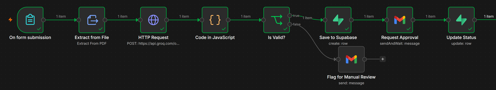
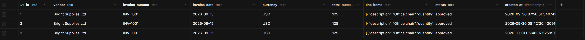

# AI Invoice Processing with Human Approval

An n8n workflow that reads PDF invoices with AI, validates the data,
stores it in Supabase, and sends it to a manager for approval by email.

## How it works
## Screenshots

Workflow:

Database after an approval:

1. A PDF invoice is uploaded through an n8n form
2. Text is extracted from the PDF
3. An LLM (via REST API) returns structured JSON: vendor, invoice number,
   date, currency, total and line items
4. A validation step checks required fields, the total, and the date format
5. Valid invoices are saved to Supabase (PostgreSQL) with status "pending"
6. A manager approves or rejects by email (Gmail send-and-wait)
7. The database status is updated to "approved" or "rejected"
8. Invalid invoices are emailed for manual review instead of being saved

## Tools
n8n, Groq LLM API, Supabase (PostgreSQL), Gmail, JavaScript

## Setup
1. In n8n, import `invoice-workflow.json` (menu, then Import from file)
2. Create the table using `schema.sql` in Supabase
3. Connect your own credentials: LLM API key, Supabase, Gmail
4. Replace the example email addresses in the Gmail nodes

## Ideas for improvement
- OCR for scanned invoices
- Slack or Telegram approvals
- A dashboard page listing all invoices and their status
